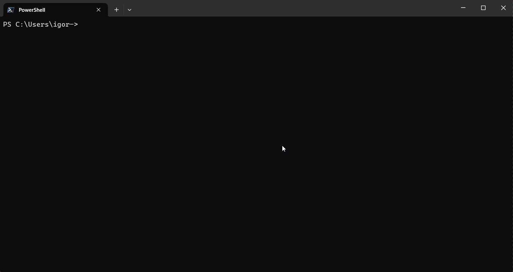

<div align="center">
    <h1>Caesar Cipher</h1>
    <div>
        
    </div>
    <br>
    <p>Caesar Cipher CLI tool made with Typer.</p>
</div>

## About

The Caesar Cipher is a **very simple encryption technique** in which each **unaccented alphabetic character** is replaced by another according to the shift to the left or right, given the desired number of positions. For example, by shifting three positions to the right, 'A' would be replaced by 'D', 'B' would become 'E', and so on.

## How to install (using [Pipx](https://pypa.github.io/pipx/))

```bash
pipx install git+https://github.com/ig0r-ferreira/caesar-cipher.git
```

## How to use

```bash
caesar-cipher --help
```

## Author

-   [Igor Ferreira](https://github.com/ig0r-ferreira)

## License

This project is under license from [MIT](LICENSE).
